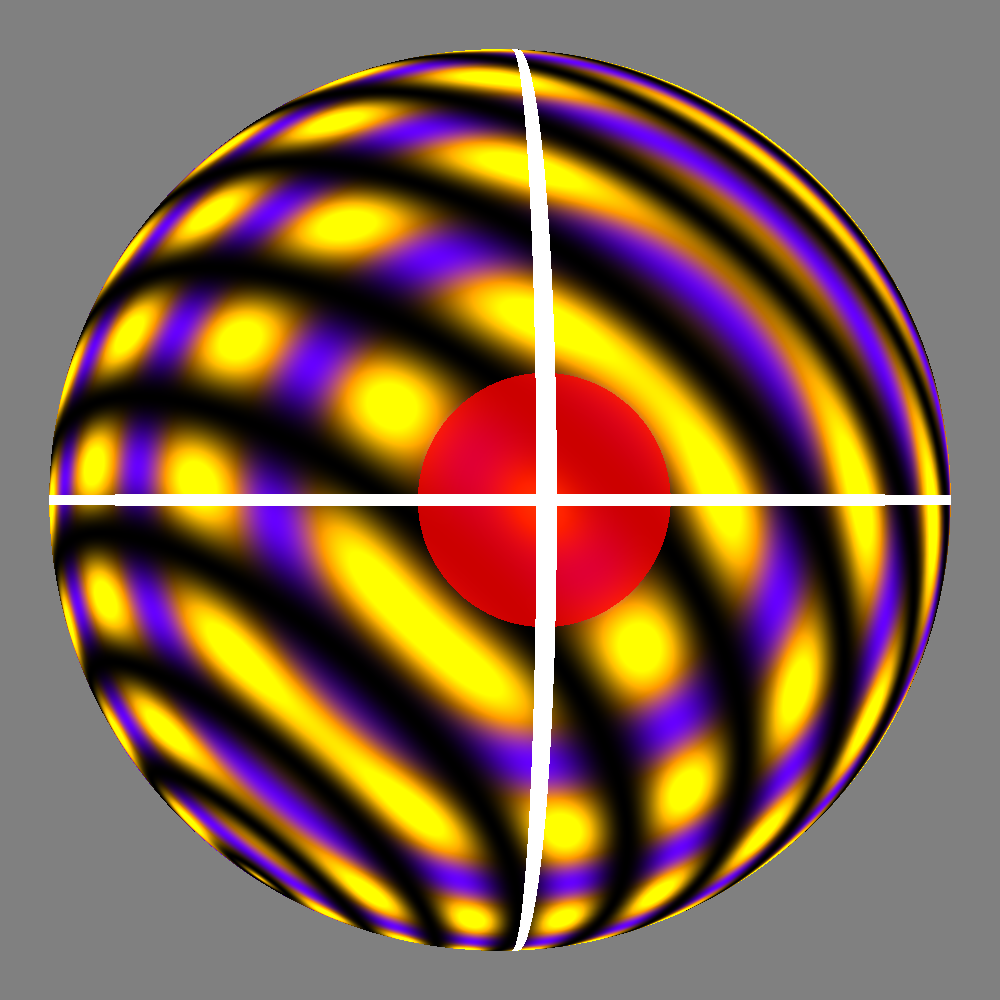
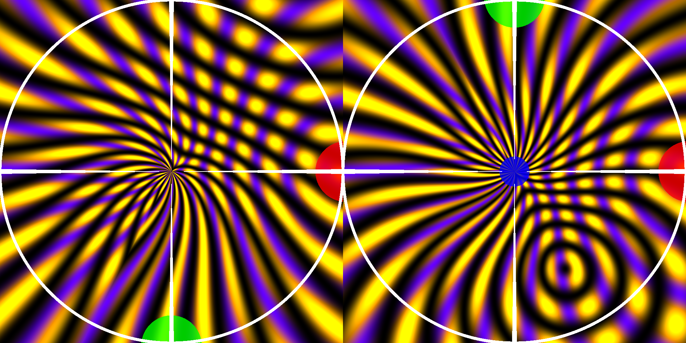
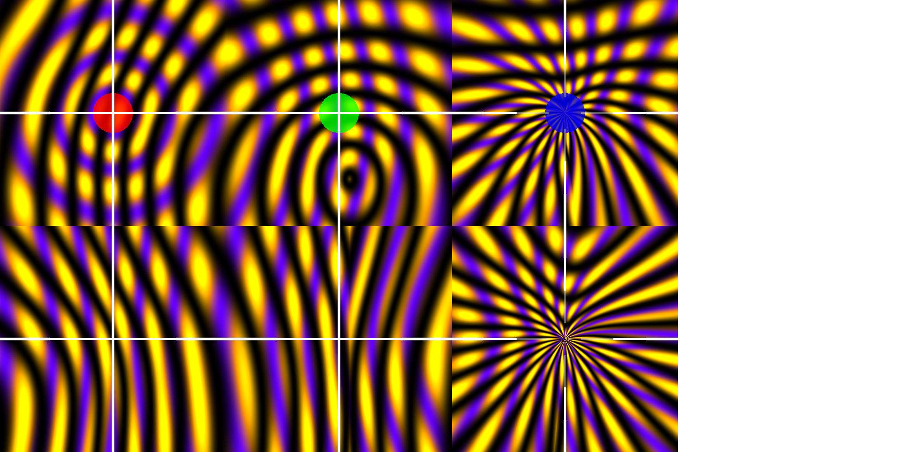
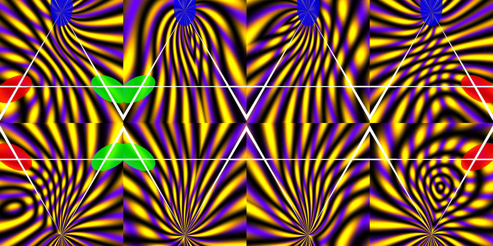

## Mainfolds (2020)

Some p5.js sketches to explore projective geometry using shaders.

:warning: ARCHIVED - Due to a Assignment of Inventions Agreement I signed
when I started working at Cesium, this copyright for this project was assigned
to my employer Cesium GS, Inc. This project is still open-source under the
Apache 2.0 license. However, I choose not to maintain this repo anymore, and
have archived it.

## Projections

This sketch takes a 3D sphere and projects it into 2D
a few different ways, 

the 3D view is a rotating sphere, with key points marked: +x (red), +y (green), +z (blue). The pattern is just some waves that move around in purple, yellow and black. The equator and great circles through +x and +y are also labeled. These will serve as
reference points

### Stereographic Projection

For the stereographic projection, the sphere is placed tangent to a horizontal plane at the south pole. Each ray start
at the opposite pole, goes through a point on the sphere, then intersects the image plane. 

This captures all points except the pole (which is projected to infinity), so 2 charts are needed (one for each hemisphere).

(left: southern hemisphere, right: northern hemisphere)

### Gnomonic Projection

For the gnomonic projection, again the plane is placed tangent
to the sphere, but this time rays are projected from the center
of the sphere, not the pole.

This can only capture one hemisphere at a time, (not including the great circle boundary). To completely cover the whole
sphere, you need at least 6 projections, one for each cardinal
direction. This 6-chart projection is equivalent to a cubemap

(top row: +x, +y, +z)
(bottom row: -x, -y, -z)

### Octahedral Projection

This is similar to a gnomonic projection, except now
we take 8 planes through the faces of an octahedron
with vertices at +/-x, +/-y, and +/-z. This maps the
selected octant of the sphere to an equilateral triangle

(top row: the 4 upper faces)
(bottom row: the 4 bottom faces)
